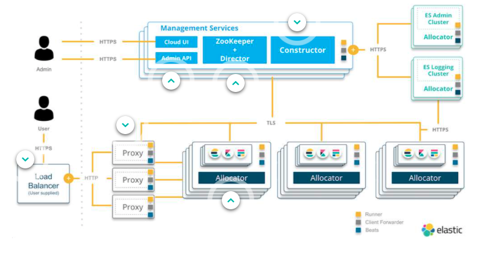

# ECE Fundamentals On-Demand 2.7.0
- Start 9/8/2021
- Created lab account through Google Sign-in `devin.harris@elastic.co`
- **Strigo access URL** `lymkglhewd8rdtkho-t2dd9wifgdpnqbwyj.labs.strigo.io`
  - **Lab Credentials**: `training`, `nonprodpwd` 
## 1. Elastic Cloud Enterprise Architecture
- ECE can be deployed anywhere including bare metal hardware, all services are containerized
  - Allows us to manage a large number of ElasticSearch Clusters
  - Maximizes HW utilization
### Architecture

- Service Oriented
  - Roles: 
    - Proxy: Handles user requests, keeps track of state & availability, helps with scaling
      - Load Balancer: Proxies are generally set up behind a Load balancer
    - Allocator: Run all the instances where ElasticSEarch and Kibana nodes. Allocators create new containers and start them when needed.
    - Coordinator: 
      - Constructor: Scheduler - deterimines what changes need to be made and writes to Zookeeper. Also assigns nodes to the proper Allocator
      - Cloud UI
      - API
    - Director: Manages the distributed data store
  - Runners: "supervisors" assigned one or more roles
- Containerized (Docker)
- Deployment state coordination using Zookeeper
- Easy Access through Cloud UI
### Lab 1 - Elastic Cloud Enterprise Architecture
- ECE requires Ubuntu, Red Hat, Centos or SUSE to run
- This lab walked through a highly technical setup of ECE including lots of Linux configuration changes
  - I'm not sure how relevant this is for me, so I'm asking in my [original issue](https://github.com/elastic/infosec/issues/7433#issuecomment-915308822)
  -
## Lesson 2: Elastic Cloud Enterprise Interfaces
- Installing: `(curl -fsSL https://download.elastic.co/cloud/elastic-cloud-enterprise.sh) install`
  - Downloads and runs Elastic Install Script
  - Downloads and installs several Elastic Stack Packs by default
  - Displays output with details for administering the new install including:
    - username
    - password
    - tokens
    - etc...
  - We can tour the cloud UI from the output, there are two default users created
    1. `admin`
    2. `readonly`
### ECE Cloud UI
#### Deployments
- 3 by default
  - admin console
    - backs the cloud UI 
  - logging and metrics
    - collects logs and performance metrics 
  - security cluster 
    - user and role management for cloud UI and SSO for deployments are handled here
- From the deployments view we can see key information about the deployments
- Each deployment has an overview page that provides key information about that deployment including information about the ElasticSearch and Kibana deployments 
